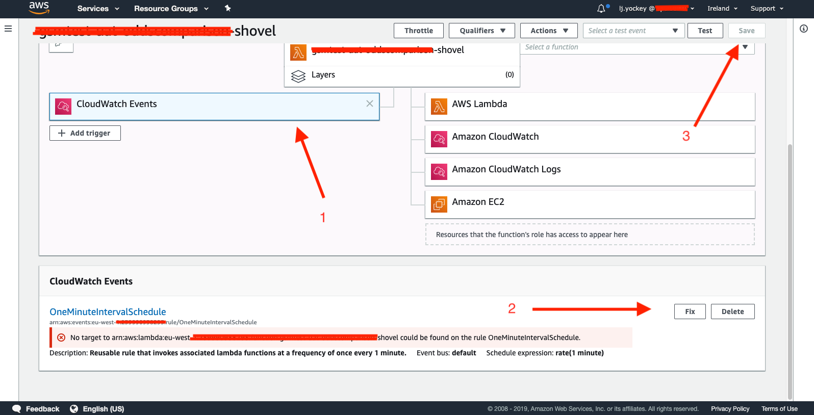

> This article was originally posted on [LinkedIn](https://www.linkedin.com/pulse/creating-applying-reusable-schedule-rules-aws-lambdas-leo-yockey/).

My team typically uses AWS Lambdas when we have a function that needs to run on an interval. That interval is specified with an [AWS CloudWatch Event](https://docs.aws.amazon.com/AmazonCloudWatch/latest/events/WhatIsCloudWatchEvents.html), where our Lambda function is the "Target" entity to which a rule is applied. My team deploys lambdas using [Serverless](https://serverless.com/), which would create a new rule for each instance of our Lambda thanks to the "events" step in each function in our serverless.yml config:

```yaml
events:
  - schedule:
      rate: rate(1 minute)
      enabled: true
```
This would create a new rule with a name that was generated automatically. The problem with this setup is that **AWS limits each region to 100 rules total**, and our preferred region is dangerously close to that limit. Since most of our Lambdas use the same rule, a 1-minute schedule, the plan was originally to create a single "OneMinuteInterval" rule that all of our Lambdas could use moving forward. We quickly discovered that **AWS limits each rule to only 5 targets**. You can read more about AWS CloudWatch Event limits [here](https://docs.aws.amazon.com/AmazonCloudWatch/latest/events/cloudwatch_limits_cwe.html).

In order to keep all of our assets in the same region and respect this limited, shared space, our current solution is to create a reusable rule to assign to each Lambda. Why? Since most of our Lambdas work in tandem with a microservice, we typically have 3 instances of the same function, one for each of our environments. Having all 3 environments share the same rule will **reduce the number of rules we're creating by 66%**. This also means that if we decide to change the rule that invokes a function, **we can update it without any code changes**.

So, how do you do it?!

### Steps
1. Login to AWS and navigate to CloudWatch > Rules > Create rule

2. Setup the conditions for your rule. You can add lambda functions as Targets at this step if they are already deployed. Rules must have at least one target. If you don't want to deploy first, you can set an existing Lambda as the target and remove it once you've completed the rest of the steps. Click "Configure details" when finished.

3. Name your rule. I like to name my rule after the function using it, but this is not required. Create the rule and it will be ready to use with serverless. Be sure to navigate to the rule and copy its ARN.

4. Go back to your serverless.yml file. Make sure that you have the plugin [serverless-plugin-existing-cloudwatch-rule](https://github.com/alex-murashkin/serverless-plugin-existing-cloudwatch-rulelisted) as a dependency in this project as well as a plugin in the yml file.

5. Replace the events step in the function which you want to use this new rule. The plugin will then add the necessary permissions to the lambda function itself to complete the "link" between CloudWatch and Lambda.

```yaml
events:
    - cloudWatchRuleArn: '{function-arn-goes-here}'
```

6. Deploy serverless as you normally would. If you already assigned the lambda as a target in step 2, you're done. If not, complete these final steps:
    * Navigate to the lambda function and click "CloudWatch Events", which will reveal a new card with an error message that reads "No target to (function-ARN) could be found on the rule (rule-name)
    * Click "Fix"
    * Click "Save"



### Conclusion
While we weren't able to be as efficient as we wanted, overcoming this hurdle bought us some time as we work to lessen our dependencies on Lambdas and migrate to smarter data queries.